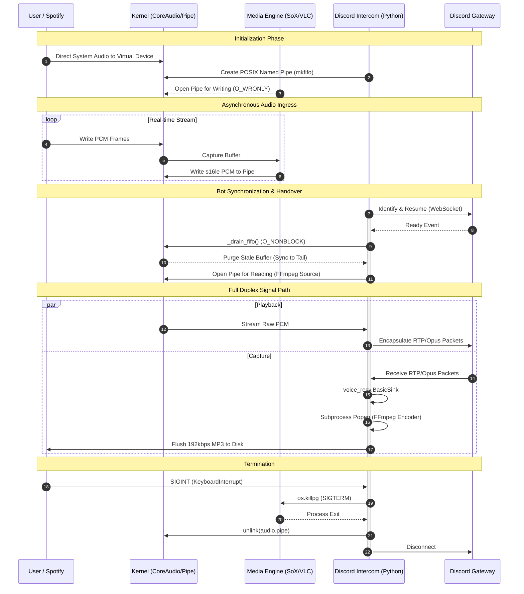

# Discord Intercom

A high-performance Discord voice utility designed for low-latency audio recording and playback. This project leverages `discord-ext-voice-recv` for full-duplex audio and uses **Named Pipes (FIFOs)** to bridge external media players like VLC with the Discord Voice Gateway.


## Core Features

* **Real-time MP3 Encoding:** Records raw PCM from Discord and pipes it through FFmpeg to produce 192kbps MP3s on the fly.
* **VLC Integration:** Use VLC as a high-level GUI/Media engine to stream any source (YouTube, local files, network streams) into a Discord Voice Channel.
* **Full Duplex:** Capability to record and play audio simultaneously within the same bot session.

## Architecture Diagram




## Requirements

### System Dependencies

* **FFmpeg:** Required for audio transcoding and MP3 encoding.
* **libopus:** Required for Discord voice encryption.
* *macOS:* `brew install opus ffmpeg`


* **uv:** Recommended Python package and project manager.
* **VLC:** (Optional) Required for `discord_vlc.py` streaming.

### Environment Setup

Create a `.env` file in the root directory:

```bash
DISCORD_BOT_TOKEN=your_token_here
```

## Installation

```bash
uv sync
```

## Usage

### 1. Recording to MP3

Capture all audio from a specific voice channel.

```bash
source .env && uv run src/discord_intercom.py --channel-id {ID} --output recording.mp3
```

### 2. Basic Audio Playback

Stream a local raw PCM or MP3 file directly.

```bash
source .env && uv run src/discord_intercom.py --channel-id {ID} --input music.mp3

```

### 3. VLC-to-Discord Stream (GUI or Headless)

This command launches a VLC instance that pipes audio into the Discord bot. This allows you to use VLC's playlist and volume controls.

```bash
source .env && uv run src/discord_vlc.py --source "https://www.youtube.com/watch?v=..." --channel-id {ID}

```

---

## Technical Architecture: Audio Piping

The system uses a **Named Pipe (FIFO)** to transfer audio between VLC and the Bot. This prevents disk I/O bottlenecks and minimizes latency.

| Stage | Process | Format |
| --- | --- | --- |
| **Input** | VLC / FFmpeg | Source (MP3, URL, etc) |
| **Bridge** | Named Pipe (`.pcm`) | Raw PCM (s16le, 48kHz, Stereo) |
| **Output** | Discord Bot | Opus-encoded RTP Stream |

### Manual Pipe Debugging

If you need to verify the audio stream integrity outside of the bot:

**Generate PCM with FFmpeg:**

```bash
ffmpeg -i in.mp3 -f s16le -ar 48000 -ac 2 out.pcm

```

**Monitor Pipe with ffplay:**

```bash
ffplay -f s16le -ar 48000 -ch_layout stereo out.pcm

```

## 🛠 FAQ

### What if I don't want to play music with VLC?

You can capture and stream audio from any application (e.g., Chrome, Spotify) using **SoX** and **BlackHole**.

While **FFmpeg** is the standard for video, its macOS `avfoundation` driver frequently suffers from clock drift, leading to the "mess of crackles" or stuttering often reported on Apple Silicon. **SoX** is a dedicated audio utility that hooks directly into **CoreAudio**, providing a significantly more stable, jitter-free stream.

**Setup Instructions:**

1. **Install Dependencies:**
```bash
brew install sox blackhole-2ch

```


2. **Route Audio:** In **Audio MIDI Setup**, create a **Multi-Output Device** that includes **BlackHole 2ch** and your primary output (speakers/headphones). Set this as your System Output.
3. **Run the Pipeline:**
Use a Named Pipe (FIFO) to bridge the audio stream to the Intercom tool:
```bash
# Create pipe, start SoX in background, and launch Intercom
mkfifo audio.pipe 2>/dev/null
sox -t coreaudio "BlackHole 2ch" -t raw -r 48k -e signed-integer -b 16 -c 2 audio.pipe & 
intercom --input audio.pipe --channel-id YOUR_CHANNEL_ID

```


**Why this works:**
FFmpeg's `avfoundation` layer adds overhead and timing complexities that often result in buffer underruns. By using SoX to handle the raw PCM capture, you bypass the video-centric abstraction layer, ensuring audio bits are delivered with hardware-locked timing.

## License
This project is licensed under the [MIT License](https://opensource.org/licenses/MIT). 
